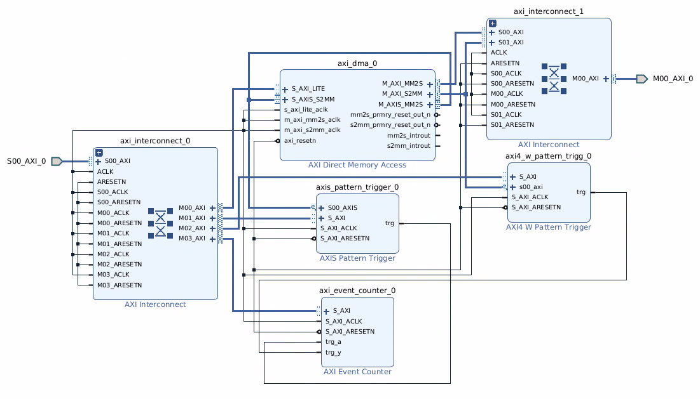
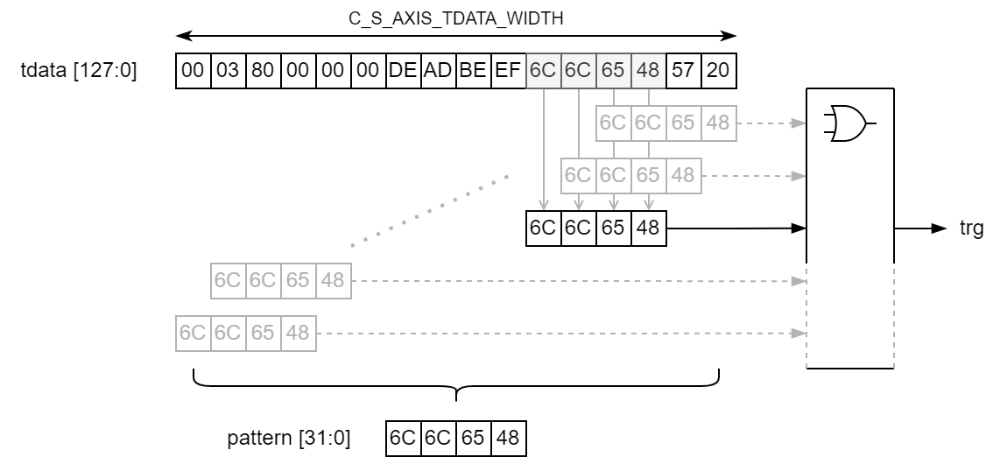

# Pattern Detecting AXI Latency Counter
Performance counter to measure latency between two AXI Stream interfaces with pattern matching as trigger.

This repository contains 3 IP packaged cores written in VHDL.
The main IP core (axi_event_counter) is a simnple clock cycle counter that can be triggered by puling the start (trg_a) and stop (trg_b) inputs.
Two additional IP cores provide pattern detection on the AXI4 wdata channel or AXIS tdata channel.
A specific data pattern can be sent through some custom IP design and the pattern triggers set up to trigger an output pulse, when the special pattern passes the monitored interface.

### Example Design

The following example design measures the latency of the `axi_dma_0` IP by monitoring the input `AXIS_S2MM` bus and the output `AXI4_S2MM` bus.

### IP Documentation

User Guides:

- [UG_AXI_Event_Counter.pdf](doc/UG_AXI_Event_Counter.pdf)
- [UG_AXI4_W_Pattern_Trigger.pdf](doc/UG_AXI4_W_Pattern_Trigger.pdf)
- [UG_AXIS_Pattern_Trigger.pdf](doc/UG_AXIS_Pattern_Trigger.pdf)

### Pattern Detection

Features of the pattern detection implementation. See user guides for more details.

- bytes alligned comparison
- compare pattern currently hardcoded to 4 bytes (`C_S_AXI_DATA_WIDTH`)
- customizable monitor interface data width (`C_S_AXIS_TDATA_WIDTH`)

Note that Ethernet packets on AXIS interfaces are `BIG_ENDIAN` and MicroBlaze typically uses `LITTLE_ENDIAN`.

### Tools

Simulated using GHDL 3.7 / implemented and tested with Xilinx Vivado 2021.2
